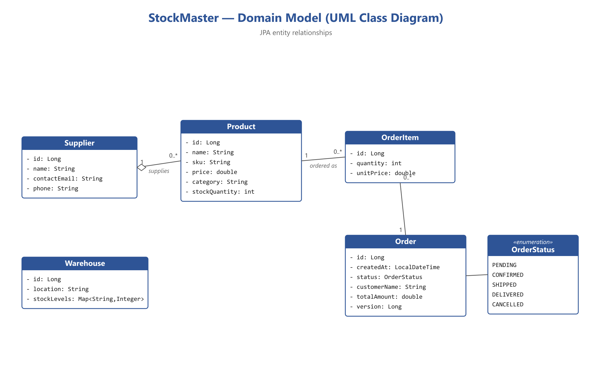

# 📦 StockMaster — Inventory & Order Management System

> **CS 305 — Advanced Java · Semester Project**

StockMaster is a Spring Boot REST application for managing products, suppliers,
warehouses, and customer orders. It demonstrates all ten course requirements
(**R1–R10**): Collections, Generics, Lambdas, Streams, Concurrency, JDBC, JPA/ORM,
RESTful Web Services, Design Patterns, and Exception Handling.

---

## Domain Model



*Figure 1 — StockMaster domain model (JPA entity relationships).*

- **Supplier** `1 — N` **Product** — a supplier provides many products (`@OneToMany` / `@ManyToOne`)
- **Order** `1 — N` **OrderItem** — an order contains many line items (cascade + orphan removal)
- **OrderItem** `N — 1` **Product** — each line item snapshots the product price at order time
- **Warehouse** holds a `Map<String, Integer>` of SKU → quantity via `@ElementCollection`

---

## Prerequisites

- **Java 17+** &nbsp;(verify: `java -version`)
- **Apache Maven 3.8+** &nbsp;(verify: `mvn -version`)
- **PostgreSQL 14+** running locally on port `5432`

---

## Database Setup

Open a PostgreSQL shell (`psql`) as a superuser and run:

```sql
CREATE DATABASE stockmaster;
CREATE USER stockuser WITH PASSWORD 'stockpass';
GRANT ALL PRIVILEGES ON DATABASE stockmaster TO stockuser;

-- PostgreSQL 15+ also needs schema privileges:
\c stockmaster
GRANT ALL ON SCHEMA public TO stockuser;
```

Credentials can be changed in `src/main/resources/application.properties`.
Hibernate creates all tables automatically on first run (`ddl-auto=update`).

---

## Compile & Run

```bash
mvn clean compile          # compile only
mvn spring-boot:run        # run the app (http://localhost:8080)
mvn clean package          # build an executable jar in target/
```

To run the packaged jar:

```bash
java -jar target/stockmaster-1.0.0.jar
```

Then open **http://localhost:8080** for a friendly index of all endpoints.

---

## Sample API Calls (curl)

```bash
# 1. Create a supplier
curl -X POST http://localhost:8080/api/suppliers ^
     -H "Content-Type: application/json" ^
     -d "{\"name\":\"TechSupply Co\",\"contactEmail\":\"orders@tech.com\",\"phone\":\"+355-69-000\"}"

# 2. Create a product (use the supplier id returned above)
curl -X POST http://localhost:8080/api/products ^
     -H "Content-Type: application/json" ^
     -d "{\"name\":\"USB-C Hub\",\"sku\":\"USBC-HUB-01\",\"price\":49.99,\"category\":\"Electronics\",\"stockQuantity\":100,\"supplier\":{\"id\":1}}"

# 3. Place an order with a 10% discount  (Builder + Strategy + ReentrantLock)
curl -X POST http://localhost:8080/api/orders ^
     -H "Content-Type: application/json" ^
     -d "{\"customerName\":\"Alice\",\"items\":{\"1\":2},\"discountType\":\"PERCENTAGE\",\"discountValue\":10}"

# 4. Stream demos
curl http://localhost:8080/api/products/grouped
curl http://localhost:8080/api/products/inventory-value
curl http://localhost:8080/api/orders/grouped
curl http://localhost:8080/api/orders/revenue

# 5. Concurrency demo (parallel warehouse check)
curl "http://localhost:8080/api/warehouses/stock-check?sku=USBC-HUB-01&qty=5"

# 6. JDBC report demos
curl "http://localhost:8080/api/products/low-stock-report?threshold=10"
curl http://localhost:8080/api/orders/revenue-report
```

> **Note:** On Windows the line-continuation character above is `^` (PowerShell
> users should put the whole command on one line or use a backtick `` ` ``).

---

## Requirement Map (R1–R10)

| Req | Feature | Primary Location |
|-----|---------|------------------|
| **R1** | Collections | `ArrayList`/`HashMap`/`TreeMap` (ProductService, Warehouse, StockEventPublisher, OrderService) |
| **R2** | Generics | `Repository<T>`, `PagedResult<T>`, `mapProducts(Function<Product,R>)` |
| **R3** | Lambda / Functional | `Predicate`, `Function`, `Comparator` in ProductService |
| **R4** | Stream API | `filter`/`map`/`sorted`/`groupingBy`/`reduce`/`sum` in services |
| **R5** | Concurrency | WarehouseStockChecker (ExecutorService + Future), OrderService `ReentrantLock`, Order `@Version` |
| **R6** | JDBC | `jdbc/ReportingRepository` (PreparedStatement, ResultSet) |
| **R7** | JPA / ORM | `entity/*` with `@Entity`/`@OneToMany`/`@ManyToOne`/`@Version` |
| **R8** | REST | `controller/*` (`@RestController`, full CRUD) |
| **R9** | Design Patterns | Builder (OrderBuilder), Strategy (DiscountStrategy), Observer (StockObserver/StockEventPublisher) |
| **R10** | Exception Handling | `exception/*` custom exceptions + GlobalExceptionHandler |

---

## Package Structure

```
com.stockmaster
  .entity        JPA entities (Product, Supplier, Order, OrderItem, Warehouse)
  .enums         OrderStatus
  .repository    Spring Data JPA repositories (+ base.Repository<T>)
  .dto           PagedResult<T>, StockReportDto, OrderRequest
  .exception     custom exceptions + GlobalExceptionHandler
  .pattern       builder / strategy / observer
  .concurrency   WarehouseStockChecker
  .jdbc          ReportingRepository
  .service       ProductService, OrderService, SupplierService, WarehouseService
  .controller    Product / Order / Supplier / Warehouse controllers
```
